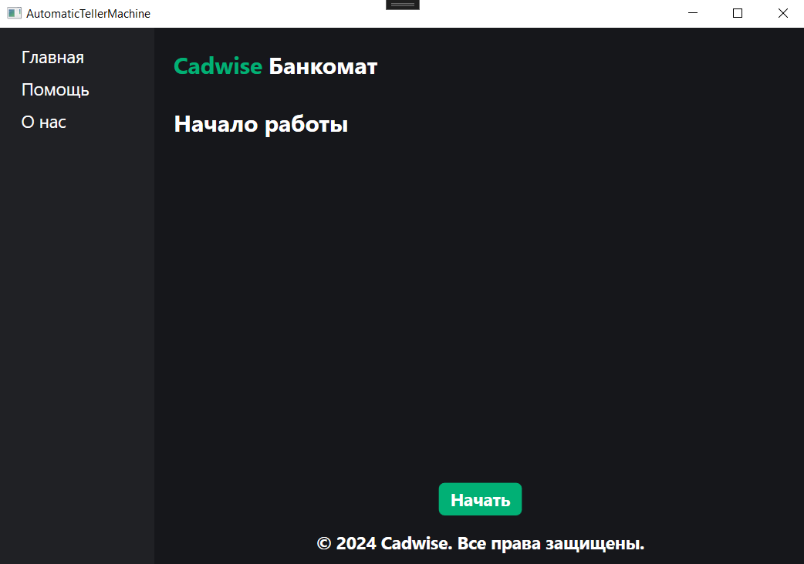
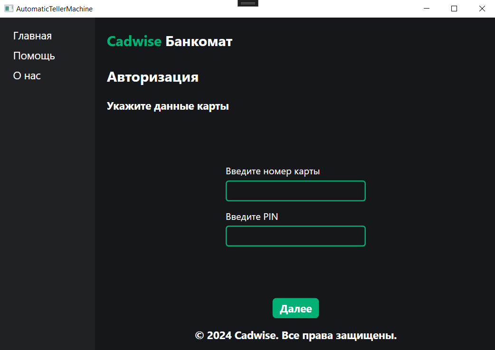
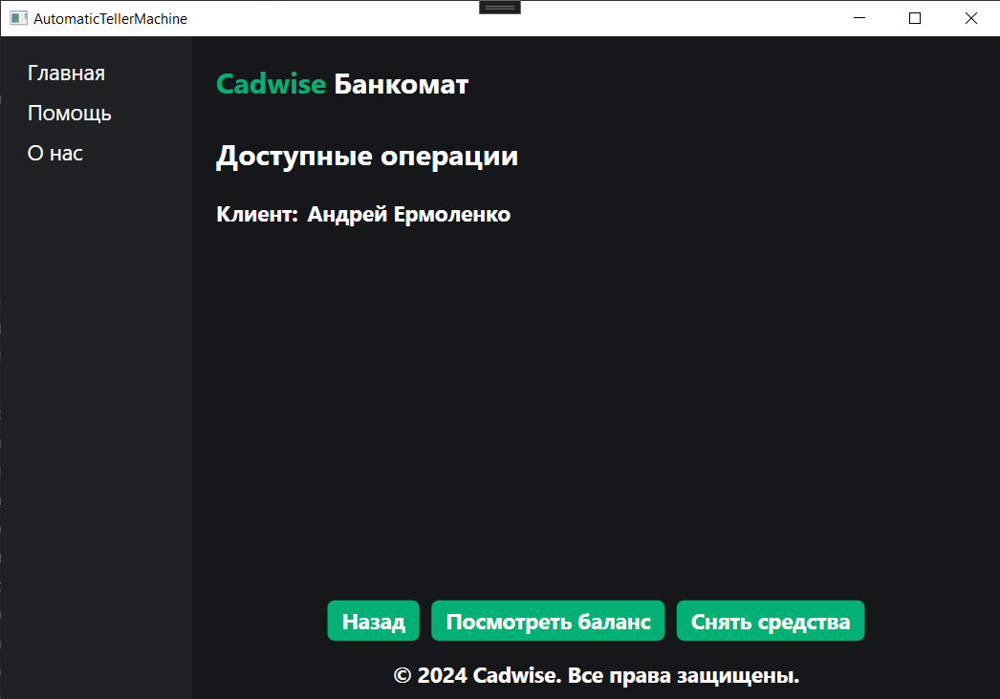
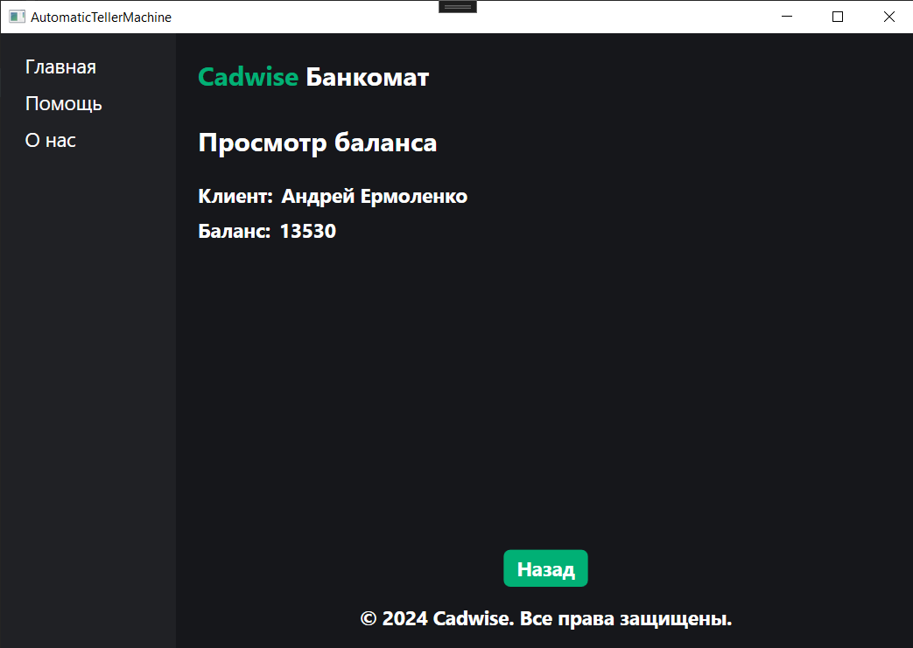
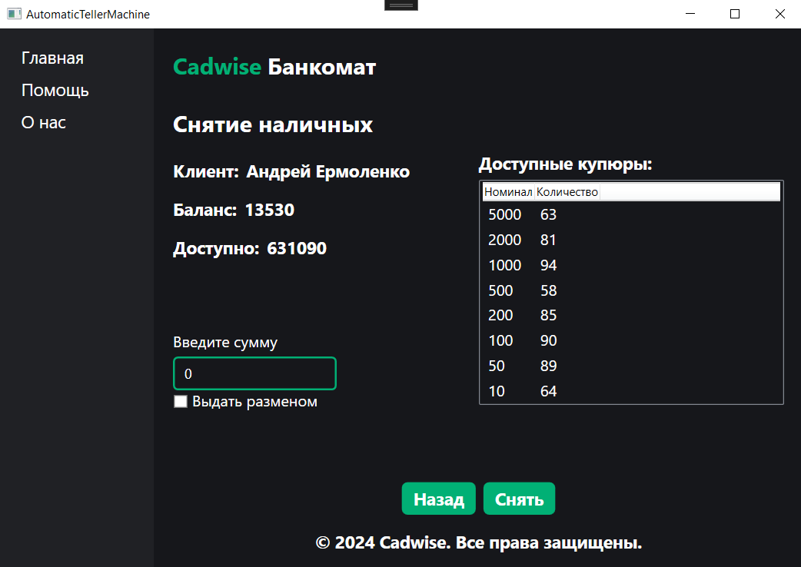
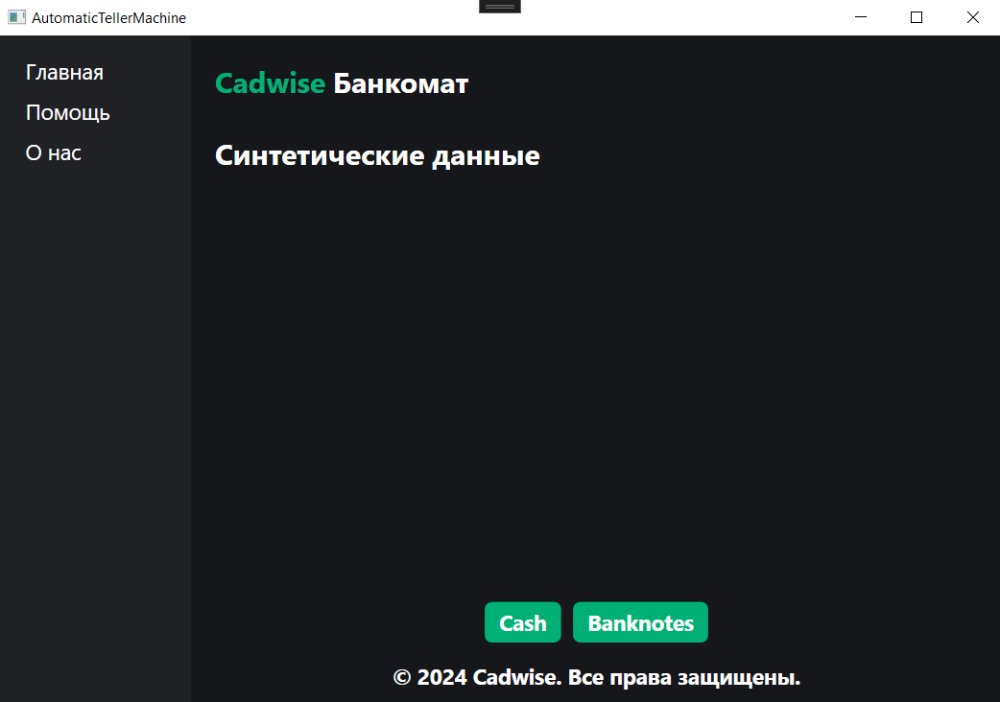
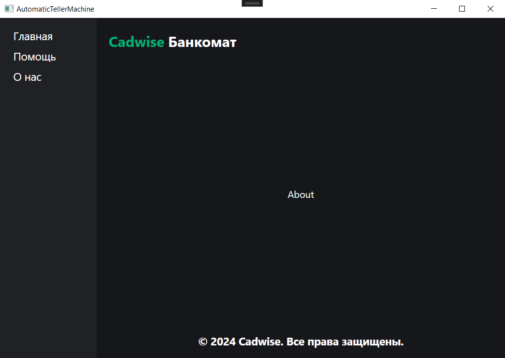
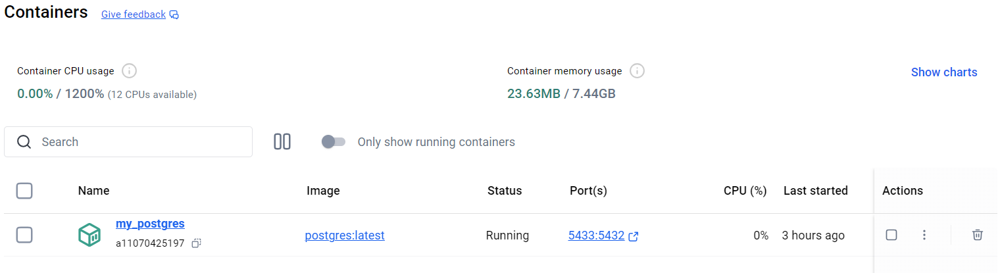

# Cadwise Банкомат

## Краткое описание

Программа "Банкомат" предназначена для имитации работы банкомата. Она позволяет пользователю выполнять операции просмотр баланса
и снятие наличных, а также просматривать состояние банкомата, включая информацию о текущем балансе, наличии и количестве банкнот
различного номинала.

## Пользователтский интерфейс

Рис. №1 - Пользовательский интерфейс

### Основные элементы пользовательского интерфейса

- **Панель навигации**

- **Основной контент**

  - _Страница "Начало работы"_

    

    Рис. №2 - Страница "Начало работы"

  - _Страница "Авторизация"_

    

    Рис. №3 - Страница "Авторизация"

  - _Страница "Доступные операции"_

    

    Рис. №4 - Страница "Доступные операции"

  - _Страница "Просмотр баланса"_

    

    Рис. №5 - Страница "Просмотр баланса"

  - _Страница "Снятие наличных"_

    

    Рис. №6 - Страница "Снятие наличных"

  - _Страница "Помощь"_

    

    Рис. №7 - Страница "Помощь"

  - _Страница "О нас"_

    

    Рис. №7 - Страница "О нас"

### Основные элементы управления пользовательского интерфейса

Рис. №8 - Элементы управления (1)

Рис. №9 - Элементы управления (2)

1. **Список доступных купюр в банкомате:**

   Область для отображения номинала и количества доступных купюр в банкомате;

2. **Поле "Сумма":**

   Поле ввода, где пользователь может задать интересующую сумму для снятия наличными;

3. **Чекбокс "Выдать разменом":**

   Позволяет выбрать способ выдачи купюр;

4. **Кнопка "Назад":**

   Позволяет пользователю вернуться на предыдущую страницу;

5. **Кнопка "Снять":**

   При нажатии предоставляет пользователю информацию, какие купюры и в каком количестве ему были выданы, исходя из его запроса;

6. **Кнопка "Cash":**

   При нажатии происходит синтетического пополнение баланса у всех пользователей (используется для тестирования);

7. **Кнопка "Banknotes":**

   При нажатии происходит синтетическое заполнение банкомата всеми существующими номиналами (используется для тестирования);

## Интересные моменты программного средства

### Использование синтетических данных

В данном программном средстве активно используются синтетические данные для создания тестового окружения и проверки функциональности.
Благодаря синтетическим данным можно быстро проверять различные сценарии работы системы, такие как выдача наличных, управление балансами
пользователей и обработка ошибок. Параметры синтетических данных можно легко менять, что обеспечивает большую гибкость при тестировании системы.

### Выдача купюр разменом

Банкомат позволяет выбрать способ выдачи купюр. Пользователь может выбрать стандартный способ выдачи или разменом.

## Развертывание программного средства

1. Установить Docker Desktop

2. Авторизироваться в Docker: docker login

3. Запуск контейнера: docker run --name my_postgres -e POSTGRES_USER=admin -e POSTGRES_PASSWORD=admin123 -e POSTGRES_DB=atm -d -p 5433:5432 postgres:latest

4. Применение миграции в Package Manager Console: Update-Database

5. Приложение готово к запуску

